# Motion

This was a project I did at University, as the technology was really new at the time, there was very few sources, examples, and references online and so it took a lot of time to figure some of this stuff out. I hope this can help give some people an idea of how to implement the CMU model and save them a lot of time so they can implement them into their own awesome projects :). 

At the end, if I remember, I'll discuss potential methods to improve performance. Also environment setup might be quite different depending on hardware, this was by far one of the most annoying parts as it is mostly a process of denial and error.

## Abstract

Often today it is very common to measure somebody’s health and wellbeing solely on the basis of speed and strength. Although these are important, often for sport/performance, there is another dimension of flexibility and mobility which are strong contributors to longevity/injury-prevention. One major hurdle for people is that flexibility and mobility take far longer build and train (especially if your biology is that of a male!), and it is easy for a person to fall into the trap of only training what they are good at which is often very inefficient. 

Motion is a program which aims to produce a tailored program for users to effectively improve flexibility and mobility effectively. Motion implements the CMU OpenPose 1.7 Body_25 model for an in-depth analysis of an overhead squat. This involves using OpenCV for getting a video file input, extracting frames, stitching frames, saving frames as .jpg files, manipulating output data from the model to find Euclidean distances, angles of joints, vectorising points in 2-Dimensional space, and plotting the poses onto images in order to analyse a user’s overhead squat alongside dabbling in pose similarity and pose classifications using KNN and CNN approaches using Tensorflow and Keras libraries.

This has become especially relevant with the happening of Covid-19 pandemic in 2020 which affected everyone. Throughout this period, prevented from socialising, discouraged from going outside, businesses are shut, gyms are closed, and takeaways are cheap. It becomes very easy for people to forget to look after themselves. Especially where people are expected to carry on with all usual responsibilities such as a professional or University work. At Universities, the continually increasing emphasis on mental health from students has become more significant, applying more pressure and responsibilities than ever before onto these institutes. On the scale of a community, this can be a seemingly impossible and increasingly complicated problem to manage. To a computer scientist, it is understood that the solution to any problem is also the sum of the solutions to all its counterparts. Even if somebody could not solve the entire problem, targeting some of the problem may bring us much closer to a complete solution. Motion wishes to try and help some of this problem on the scale of the individual. In England it is estimated that 1 in 4 people will suffer from mental health problems each year (Mind.org.uk, 2020) 17% of these are in the forms of anxiety and depression. People who took part in a recent Harvard study has showed that by introducing a form of minor activity daily such an hour of walking, stretching, or any kind of low intensity movement can reduce risk of major depression by 26% and on top of that significantly help individuals from relapsing (Harvard, 2019). This does however, require individuals to take some responsibility for themselves. 

In conclusion, the CMU model has made significant progress over the last 4 years (since 2017 release) and is very precise from a front on perspective. The model is only reliable when the user is square to the camera, as human pose estimation continues to improve, hopefully one day it will have the reliability to be implemented into an application like Motion.

## Overview of human Pose Estimation 

Carnegie Mellon University are among the forefront of AI research and in this case Human Pose Estimation. OpenPose was released in October 2017 and has since had frequent and major improvements. Best of all, it is freely available to all non-commercial use, alongside great documentation. It was not until later that it was decided to use the CMU body_25 model, but for background knowledge after reading from the official OpenPose cited documentation (Zhe Cao, 2018) and sources online (Tanugraha, 2019) , (Raj, 2019). Here is a brief overview.

There are two main approaches to this problem, first is the simpler top-down approach where the model is trained to detect the human first (which is relatively simple) and then deriving each key point from the humans detected. Simply, detect each person then derive body parts from each body for every person. 

The second approach is the bottom-up approach which OpenPose uses. This is where each body part belonging to everyone is detected first and then grouped and associated together to form the person. Simply, locate everybody part in frame then using grouping methods such as part affinity fields and part confidence maps stitch each human together. Using this method, performance seems to suffer far less as more people are detected in frame.

Confidence maps are a 2D representation of the belief that a particular key point occurs in each given pixel. If there is one person in the image, a single peak should exist in each confidence map if the corresponding part is visible.

Part Affinity fields for part association needs a confidence value measuring the association of each pair of body parts belonging to which person within an image. This preserves the location and orientation information across the region supporting the limb (body part/key point). Represented by a 2-Dimensional vector field for each limb, pointing from one part of the limb to the other. Each limb has a part affinity field directing to associated body parts.
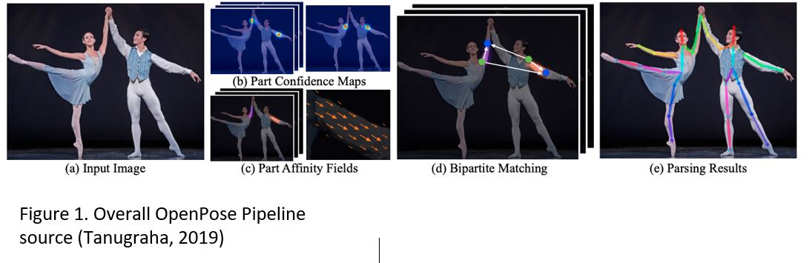
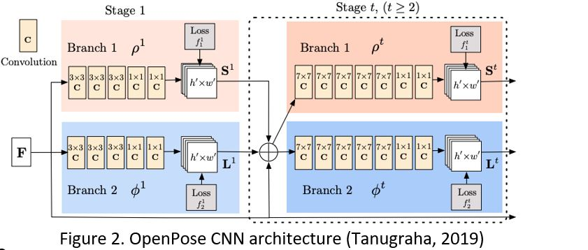

From an RGB image input, the Convolutional Neural Network splits into two layers and is stacked, default stack depth is set to 6, refining its predictions at each stage. The first layer outputs Part Confidence Maps, and the second outputting Part Affinity Fields as shown in the pipeline of figure 1. Each iteration of the stack returns more confidence in results. Then finally, outputs are processed by greedy inference to output 2D pose points for each person in frame. Both the body_25 and COCO model mentioned later are based off this architecture (shown in figure 2).

## Implementation/Realisation

### Implementing a model

The first problem was the decision in which model to use as a basis. This was a very important factor as the performance of the model would greatly impact the project. After researching the current best performing models open for commercial use and personal projects. Carnegie Mellon University (CMU) in Pennsylvania released OpenPose which achieves much better results than any other freely available model. 

The first model implemented was a CPU based COCO model. As seen in figure 10, on an intel core i5 (2.90 GHZ) CPU it was running at 1.8 frames. This model tracks 17 points on the human body. When moving the frame rate would drop as low as 0.5 fps and would often be unable to confidently locate key points. This was an issue for a project which required a high degree of accuracy such as Motion.

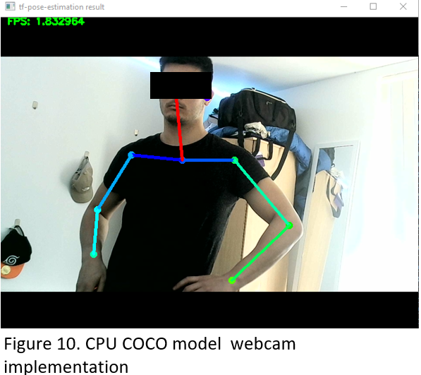

Figure 11 shows how the COCO model maps a human pose. It tracks 17 key points across the body, one major issue is that it does not track below the ankle. This information is extremely important for certain movements. Because of the slow speed and lack of accuracy it was decided it were best to switch to an alternative model. For implementation, an anaconda environment was created with an older version of TensorFlow (1.1.5.3) and python 3.7.9. As the original model is in C++ a wrapper called SWIG was used so it could be implemented with python.
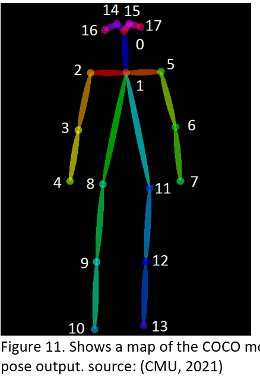

Not long after this (17th of November 2020) CMU released the newest version of OpenPose 1.7. (CMU, 2017) Using the body_25 model, which is 40% faster and 5% more accurate and includes foot key points. 

When implementing body_25 model for speed it was GPU boosted, however should be no different to a CPU implementation, only faster.

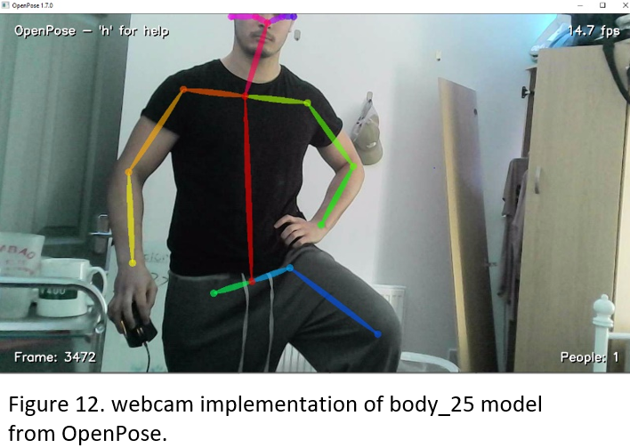

his model was significantly better, as it ran between 14-15 frames per second even with large amounts of movement. On top of this, the body_25 model tracks 24 key points (25 if you include the background) including toes and heels, which is very valuable for analysing many movements where the individual is on their feet.

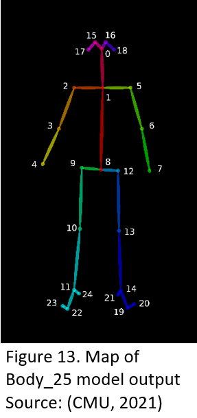

As shown in figure 13 this mapping Is far more intricate which will allow for more in-depth analysis. For example, by having points 1 (Neck), 8 (Mid-hip), 9 (Right-hip), and 12 (Left-Hip). It is much easier to detect posture or tilting in the upper body. It also looks to be a much truer representation of  a human pose. This model also maps below the ankle ,points 21 and 21 track the heels and points (22,23) , (19,20) tracks the big and little toes on each foot. This degree of pose estimation allows analysis in the relationship between heel and toes. This can be used as an indicator for balance or for a squat, it could show if heels are leaving the ground (which is quite common in inflexible people) and can be done by looking at the distances between the ankles and toes. In the real world, these distances will not change however, if the distance between the corresponding toes and ankles increase from the perspective of the camera then the cause of this would be due to the heel coming off the floor. Because of the overwhelming advantages and good documentation for the second implementation, that was the model chosen in the further development of Motion.

### Environment Set Up

Setting up a working environment proved to be very difficult as every user online had a different set up. This took a large amount of time trying different combinations which others claimed to work. Firstly Tensorflow-gpu and Keras were set up and installed within the environment. In the end downgrading Cuda from 11.1 to 10.2 and Cudnn from 8.0.5 to 7.6.5 helped solve some compatibility issues (although various other driver updates were installed). Cmake was used as a python wrapper for the model. The last hurdle was building the environment, downgrading to Visual Studio 2017 but only by using the Enterprise edition somehow worked. In the end, the environment was as follows:

System: Windows 10 

OpenPose: 1.7

Cuda: 10.2

Cudnn: 7.6.5 (for Cuda 10.2)

Visual Studio 2017 Enterprise

Python: 3.7.8

3rd party dependencies:

•	Caffe – fast deep learning framework

•	Pyblind11 – for Cmake python wrapper

Library Dependencies:

•	Math – maths operators.

•	From pathlib – Path function for directory traversal.

•	Os – for getting pathways and directory management.

•	Cv2 – computer vision tools.

•	Numpy – manipulating arrays. 

•	Tensorflow – Machine learning library for neural networks.

•	Keras – for batch normalisation in CNN layers.

•	Sklearn – managing training data and getting accuracy.

•	Matplotlib.pyplot - plotting results.

Clone the github repo: https://github.com/CMU-Perceptual-Computing-Lab/openpose.git

Open cmake:

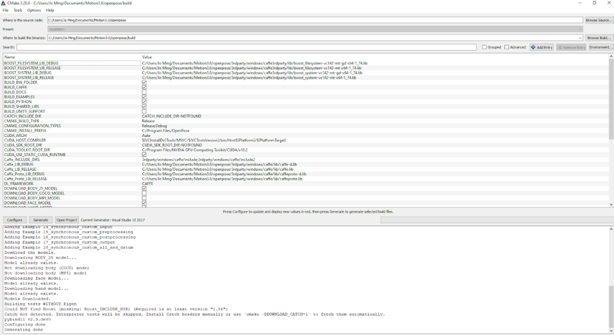

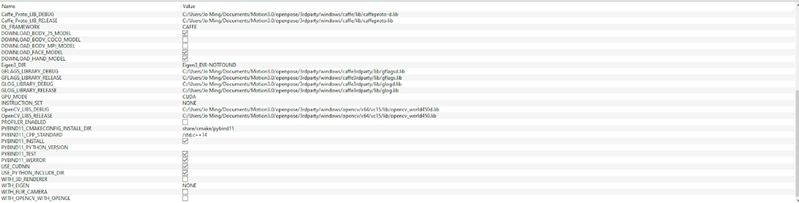

Set the correct location for source code and to the binary files. Select the boxes shown especially BUILD_PYTHON and the body_25 model as shown in image. Then click open project and be sure to generate it for windows 64x with visual studio 17 and build the solution. 

### Getting video Input

The model requires RGB image as an input, so to break down and process a video it is required to get each RGB image component. With OpenCV using cv2.videoCapture(0) can use the webcam as shown in figure 16.

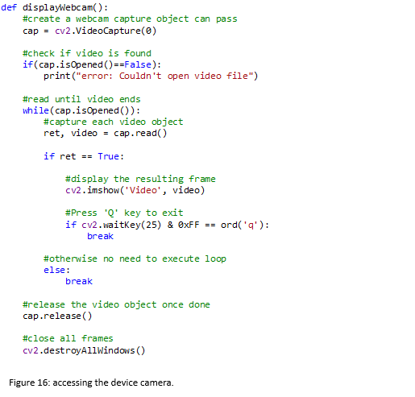

Similarly, this can also be done to a locally saved video as shown below in figure 17.

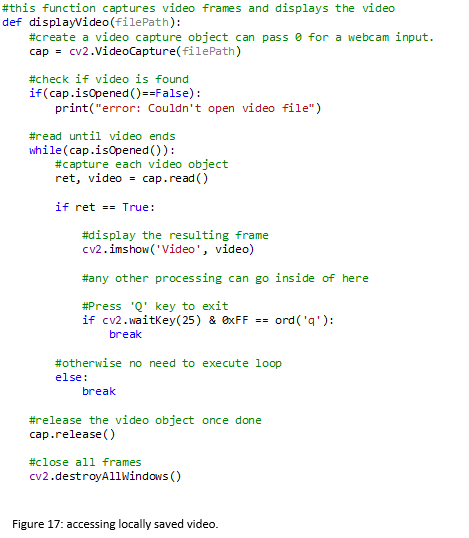

As stated inside figure 17, any processing can be done inside of this loop. By understanding this structure, it can be applied to creating a Motion object from a video. Although the concept for a live video implementation is almost identical to applying it to a saved video but because the python wrapper needs to be called each frame this causes the program to not run smoothly. This might be possible if written in a C++ framework, however it is unlikely this could run smoothly even with high end hardware due to the cost of the following processes after the model.

### MotionPicture Class

As this class is ‘lower level’ to the Motion class and is required to fill an important motion attribute it was decided to implement the MotionPicture class first. To approach this, the following questions were asked: 
•	What does it need to ‘know’?
•	What does it need to be able to do(if asked)? 
These considerations were considered with which methods could be abstracted into this class. 

#### Construction and Attributes 

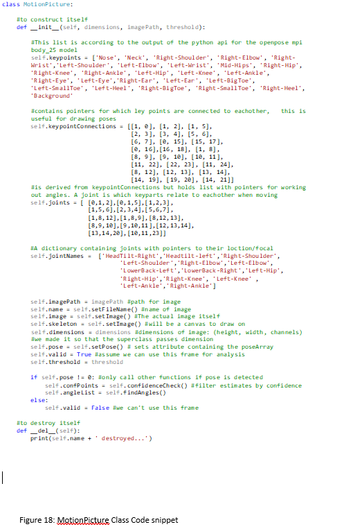

When constructing the keypoints, keypointConnections, and Joints attributes they are corresponding to the body_25 model (shown in figure 13). The dimensions, imagePath, and threshold are required as parameters. 

## OpenPose API

In order to set the pose attribute for a MotionPicture it is required to first retrieve the pose data from the OpenPose API the following code is explained inside the documentation from the CMU and was copied and tweaked from GitHub (CMU, 2020). So that it was now a callable function with appropriate file paths (figure 19). And instead of directly displaying the image and printing the pose, it now returns the pose data. Once set up other files could just import imgPoseEstimation.py and call the API (Application Programming Interface). 

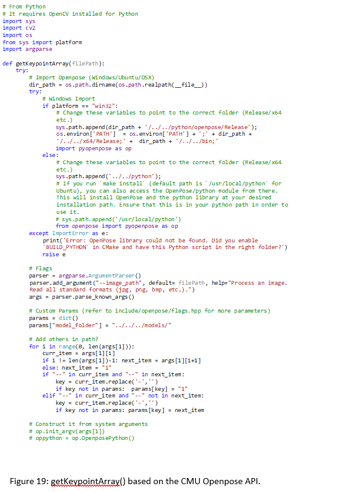

Files which imported imgPoseEstimation.py could then call this function as follows:

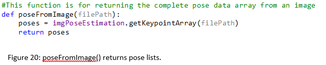

Because this model can detect multiple people and poses the data returned is a list of poses. For example, passing a file path to an image containing only one person as poseFromImage(filePath)  in figure 20 would return something like this:

[[[4.24951630e+02 1.01478683e+02 9.74723041e-01]
  [4.43344940e+02 1.63868439e+02 7.97661662e-01]
  [3.91142975e+02 1.67125839e+02 7.77096748e-01]
  [3.69281586e+02 2.36213181e+02 8.79664004e-01]
  [3.30594055e+02 2.75015686e+02 8.88313234e-01]
  [4.95547638e+02 1.58827789e+02 7.52719879e-01]
  [5.19132263e+02 2.29521042e+02 8.11474919e-01]
  [5.59648438e+02 2.75049561e+02 8.66122007e-01]
  [4.43353668e+02 3.12021271e+02 6.32788658e-01]
  [4.11362610e+02 3.13679657e+02 6.55651212e-01]
  [4.13121674e+02 4.23184601e+02 7.84300089e-01]
  [4.13050629e+02 5.30936646e+02 7.88084388e-01]
  [4.77063782e+02 3.10358734e+02 6.41459703e-01]
  [4.98923096e+02 4.24820374e+02 7.49234915e-01]
  [5.15810974e+02 5.39356506e+02 7.12319255e-01]
  [4.23094666e+02 9.14042511e+01 9.05909777e-01]
  [4.38323669e+02 9.31388016e+01 9.08547401e-01]
  [4.13058533e+02 9.98087769e+01 8.48589092e-02]
  [4.58555389e+02 1.04888695e+02 8.51745188e-01]
  [5.49480652e+02 5.59617249e+02 6.86516881e-01]
  [5.52841309e+02 5.56198486e+02 6.92318380e-01]
  [5.05665833e+02 5.52854980e+02 6.39457822e-01]
  [4.11380585e+02 5.56209473e+02 7.44374812e-01]
  [3.99566467e+02 5.52822449e+02 7.53185093e-01]
  [4.19814209e+02 5.36008179e+02 6.51502967e-01]]]

And for an image with two people, something like this:

[[[3.67780426e+02 1.47870270e+02 9.10241663e-01]
  [3.76832001e+02 2.03372498e+02 8.32872510e-01]
  [3.34909760e+02 2.21508362e+02 7.14366794e-01]
  [3.49575348e+02 3.03181488e+02 8.77458215e-01]
  [4.09690704e+02 2.94058319e+02 3.40749741e-01]
  [4.20997498e+02 1.85220963e+02 7.33595967e-01]
  [4.57341431e+02 2.57810120e+02 8.56255472e-01]
  [3.89277588e+02 2.88418976e+02 6.67714715e-01]
  [3.87049835e+02 3.31488525e+02 5.94331682e-01]
  [3.59851532e+02 3.34884399e+02 5.77581227e-01]
  [3.71164551e+02 4.14263550e+02 1.31269768e-01]
  [0.00000000e+00 0.00000000e+00 0.00000000e+00]
  [4.14220245e+02 3.29217499e+02 5.36360025e-01]
  [4.02914490e+02 4.14260895e+02 2.11324841e-01]
  [0.00000000e+00 0.00000000e+00 0.00000000e+00]
  [3.53015045e+02 1.39880966e+02 8.89510691e-01]
  [3.75694427e+02 1.34252640e+02 9.03350711e-01]
  [3.39410858e+02 1.51286880e+02 8.12914848e-01]
  [3.85854919e+02 1.41028946e+02 2.71930456e-01]
  [0.00000000e+00 0.00000000e+00 0.00000000e+00]
  [0.00000000e+00 0.00000000e+00 0.00000000e+00]
  [0.00000000e+00 0.00000000e+00 0.00000000e+00]
  [0.00000000e+00 0.00000000e+00 0.00000000e+00]
  [0.00000000e+00 0.00000000e+00 0.00000000e+00]
  [0.00000000e+00 0.00000000e+00 0.00000000e+00]]

 [[2.64627045e+02 1.07069626e+02 8.45376551e-01]
  [2.49830505e+02 1.64867065e+02 8.23167682e-01]
  [1.95499329e+02 1.56905701e+02 6.84393644e-01]
  [1.83014160e+02 2.55534424e+02 7.63060927e-01]
  [2.70287689e+02 2.49823242e+02 7.11306155e-01]
  [3.02002594e+02 1.71647003e+02 7.14712858e-01]
  [2.95243195e+02 2.65745880e+02 7.98026562e-01]
  [2.21545120e+02 2.61228577e+02 4.86596704e-01]
  [2.41931549e+02 3.24691803e+02 5.85075915e-01]
  [2.11334839e+02 3.25807770e+02 5.40356815e-01]
  [1.86447784e+02 4.14263397e+02 6.60056770e-02]
  [0.00000000e+00 0.00000000e+00 0.00000000e+00]
  [2.74822327e+02 3.29203400e+02 5.25471807e-01]
  [2.66839874e+02 4.14261292e+02 1.27551153e-01]
  [0.00000000e+00 0.00000000e+00 0.00000000e+00]
  [2.55527313e+02 9.45352249e+01 8.88754010e-01]
  [2.77107910e+02 9.90950928e+01 8.83939087e-01]
  [2.37414078e+02 9.79929886e+01 8.26341331e-01]
  [2.87284180e+02 1.09303017e+02 7.49875844e-01]
  [0.00000000e+00 0.00000000e+00 0.00000000e+00]
  [0.00000000e+00 0.00000000e+00 0.00000000e+00]
  [0.00000000e+00 0.00000000e+00 0.00000000e+00]
  [0.00000000e+00 0.00000000e+00 0.00000000e+00]
  [0.00000000e+00 0.00000000e+00 0.00000000e+00]
  [0.00000000e+00 0.00000000e+00 0.00000000e+00]]]

This returns a coordinate and confidence for each key point using a list of String types. This is not in a useful form and even for 1 person it is returned as a 3-Dimensional list, a  list for each image containing a pose. The format of the list after dimensionality reduction of the list will be 2-Dimensional, then splitting each element in the list from [string] to  [x, y , confidence].

### Formatting the desired pose 

As the output from the pose estimation model is not in a form that can be easily manipulated, the format needs to be changed so that the data can be called and analysed.

This process is broken down into 3 steps:
1.Getting the complete pose data list 
2.Find target/focal pose.
3.Format focal pose
This is however, assuming the person/pose most centred to the camera frame is intended to be the subject for analysis.

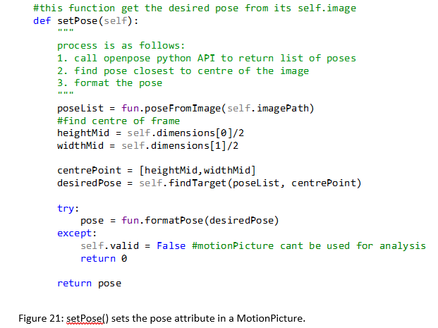

Once the pose list is received, find the centre of the frame and findTarget() is called to return the focal pose. 

By accumulating the distances of key points from the centre of the frame for each pose, the location of the smallest distance in the list will represent the position of the most central pose. Then this function in figure 22 will call the getPerson() function to isolate the specific array targeted at this person. Once the targeted pose is received it is passed into the formatPose(targetPose) function.

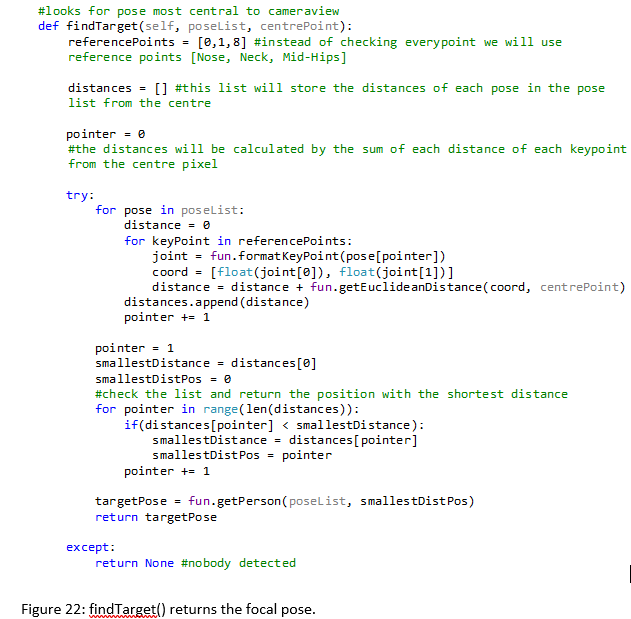

The starting form of the pose returned from the OpenPose API is a list of strings as it would have used this to write to a JSON file. To format the pose, each string representing a key point is formatted individually with the function shown in figure 23 formatKeyPoint(), the complete formatted pose is constructed from the sum of each formatted key point. To format an individual point the “[“ and “]” are sliced off either side and then the splitting function is used to divide the elements between whitespace into a single list. Which should provide 3 elements representing the X , Y , and confidence value. In hindsight it may have been wise to cast this data as a float [] here in preparing for future calculations, however this had little impact in the long run. The formatted pose is returned to setPose() in figure 21.

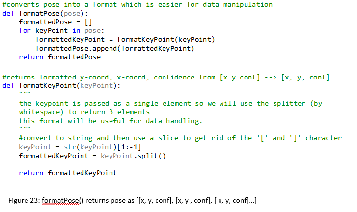

### Finding Angles

A useful function is Euclidean distance defined as:

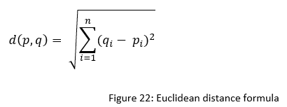

Where   p,q  are two points within a Euclidean space of n dimensions and q_i and p_i are Euclidean vectors starting from the origin of space. This was implemented into the functions.py file as the following:

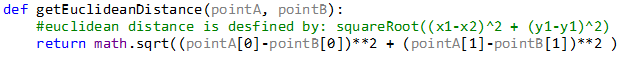

The information on this relationship between two points was imperative to this project. With this function much more information can be derived. 

In the JointsList attribute joints around the body are represented by a list of 3 key points. To utilise this into context and find angles, it is possible to Triangulate them by finding the distances between each point as shown in figure 24. 

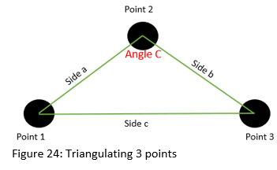

From there, using trigonometry, it is known that the lengths of sides to any triangle relate to the cosine of one of its angles. This is called the law of cosines which formula is the following:

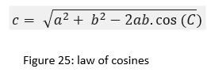

Using this formula, it can be rearranged to make angle C (opposite to corresponding side c) the subject:

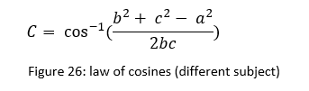

Where a, b, and c are sides to a triangle and C is the angle opposite to the corresponding letter side. Knowing this, the code can now be implemented:

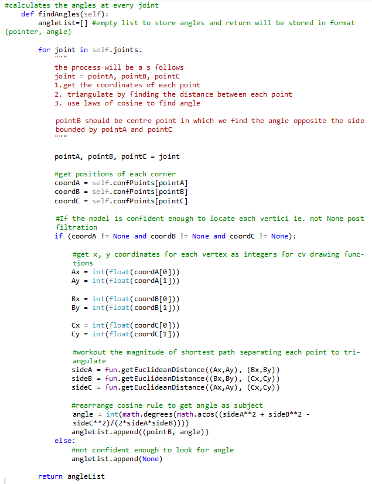

Calculating all the angles did not significantly increase the runtime so it was kept this way. For targeting single selected angles, the process would still be mostly identical except instead of looping through all joints, pointers would be used to target joints.  The important aspect here is to use the confList attribute. This is the pose after all positions which are below the given threshold are removed. Therefore, the angle is only calculated given that there is high enough confidence in all three coordinate estimations. Figure 28 displays the angle finder targeted at the angle of a split. Once confirmed that this function could find the angle of a joint, this could then be implemented to find the angle of every joint in a pose which is show in figure 29.

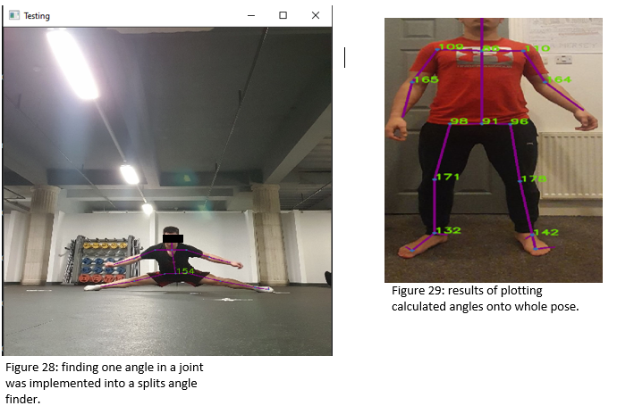

### Drawing Skeleton

Once all the necessary information is acquired i.e., pose and which key points are connected to each other. The points and connections can be plotted onto an image by drawing a circle at each key point and connecting them using straight lines (this was shown in figure 29). To achieve this, tools from the OpenCV package cv2 cv2.line() and cv2.circle allows plotting onto the image resulting in an drawing which looks somewhat like a skeleton.

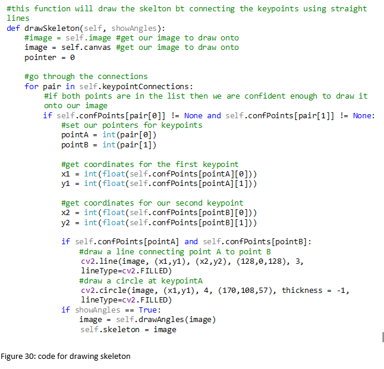

Because the skeleton is drawn from the reference of the pose, it can be drawn onto any image. For example, in the image Directory there is a blank canvas image which the skeleton can be drawn onto as shown in figure 29.

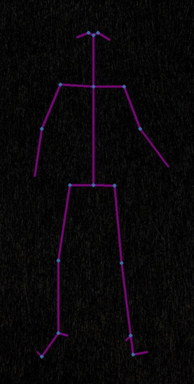

These images can then be stitched together to produce a totally anonymous .avi video file of just the pose from every frame of an input. The coordinates must be converted from a string to a float first, then a float to an int.

### Scale, Centre, and Normalise Pose

If one bases of scoring is to compare an input pose to a ‘model pose’ it is imperative to Scale, Centre, and Normalise them first. This is because someone standing closer to the camera would appear much larger than someone further away. Positioning also matters as someone standing to the side of one frame compared to another may have very similar poses but very different pixel values, making comparison tricky. To do this the pose needs to be scaled. This was done by finding the extreme values within the pose both (min and max) and the average for both x and y values. The scale factor is determined by the largest dimension (between x and y ranges), then each new point:

This way the relationships of each points are relative to the centre of the pose instead of relative to their original camera frames.

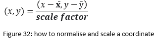

With the pose data in this format pose comparison data becomes far more valid. Although different body types can still have varying proportions, this is still far more credible than comparing the original data. The function mad also passes a flat list, meaning it is possible to use this as an input for a convolutional neural network.

### Motion class

The purpose of this class is to be able to apply functionality over a whole motion (.mp4) and all its counterparts. For example, to draw the pose over a whole motion, draw the pose over each motion picture and stitch them together. 

Construction and Attributes

To construct a Motion, 3 parameters are required. A name for displaying and saving, video path so that required data can be fetched, and a threshold to know the lowest confidence that will be tolerated for processing. The length is determined by how many frames are in the video.

Codify Motion

The purpose of this method is to populate the list inside the self.motionPictureList attribute with MotionPicture objects and to save the processed frames into a directory. The full function is available in appendix 1. The first objective is to extract each frame inside of functions.py an extractVideoFrames() was already made. So then by using a video capture object, object.read() will return frames. Next job is to then process each extracted frame by creating a MotionPicture object and drawing the pose/skeleton then saving it like so:

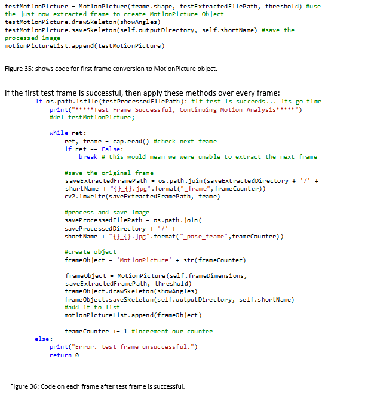

As shown in figure 36 each frame is saved under its corresponding name and frame number after being processed. Otherwise, if the test frame is unsuccessful, throw an error.  The function os.path.join() uses a string for a parameter and can be used to set a pathway to the save directories.

### Stitching frame Directory

Once all the processed frames are saved, in order to output a video the frames must be stitched together. This was done using the cv2.videoWriterObject and the directory was traversed through looping through shown in figure 30 frames one at a time. However, there was an issue that the order in which the frames collected were consistent but not the order in which they are saved in the directory. The same issue arises when using glob and a couple of other similar tools, on top of this using the built in .sort() function would sort them into this same unwanted order too. The conclusion was made that they were in order of some kind, just not the sequential order needed for a smooth video.  

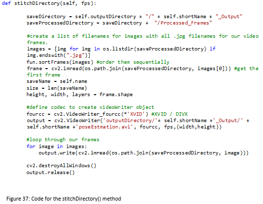

To get around this issue a quicksort function was implemented in the functions.py file and called as shown in figure 38.

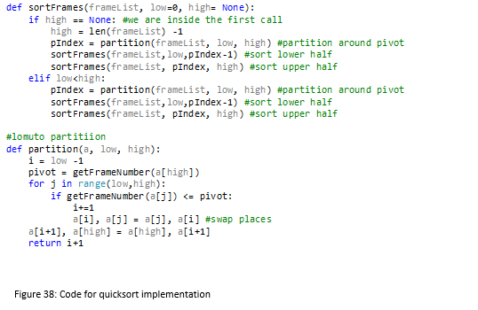

This quicksort/merge sort hybrid using recursion shown in figure 38 is more efficient over sorting a smaller number of elements (up to around 100,000) than the traditional quicksort as there is no generation/replication of lists each iteration. A typical quick sort will pass 3 lists each recursive call smaller values, equal values, larger values. So, for shorter lists, this method is better optimised.

## Demo
will do some more detailed documentation explaining how ot works and the maths behind it another day.

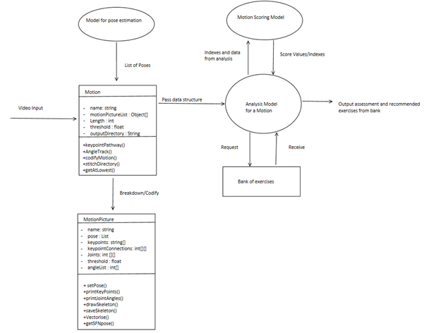

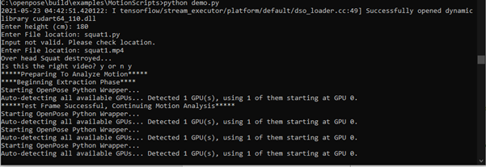

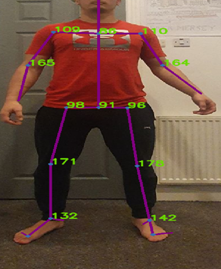

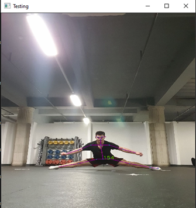

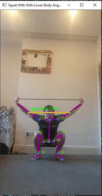

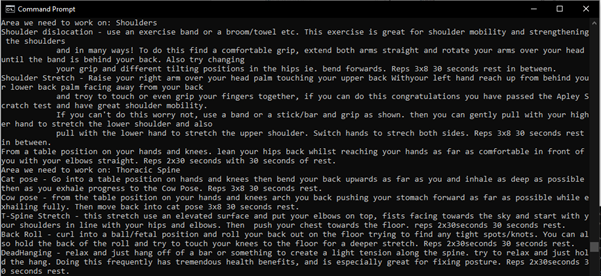

